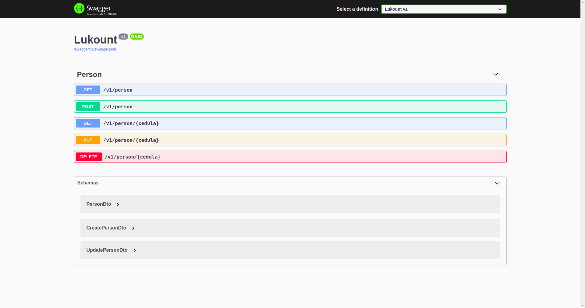

# lukount-crud
Este projecto ha sido creado para la prueba tecnica de Lukount, consiste en un crud implementado en .net5 que utiliza como base de datos Mongodb y el framework Xunit para las pruebas unitarias. 

## Configuración de la base de datos 
Mongo ha sido implementado mediante un contenedor de docker, se puede ejecutar este contenedor mediante el comando: 
```bash
docker run -d --rm --name mongo -p 27017:27017 -v mongodbdata:/data/db mongo
```
### `Nota:`
Este contenedor es fundamental para el correcto funcionamiento del crud, por lo que es recomendable ejecutar el contenedor antes del proyecto.

## Documentación
Se pueden consultar los endpoints del crud mediante la documentación de Postman o mediante swagger en la aplicación:
```
https://documenter.getpostman.com/view/14940513/Tzm6jv1V
```

<p align="center">
  
 </p>

## Pruebas Unitarias
Las pruebas pueden ser ejecutadas ingresando a la carpeta `Lukount.UnitTests` y posteriormente, mediante el comando:
```bash
dotnet test 
```
Estas pruebas estan enfocadas en las funcionalidad de las peticiones HTTP.

## Despliegue con Docker:
Actualmente se cuenta con una imagen en dockerhub, lo que permite poder utilizar docker para su uso, mediante:
```
docker push fcsource/lukountcrud:v1
```


